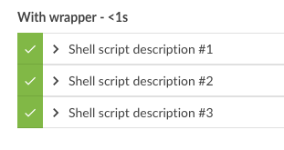
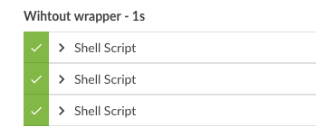

# jenkins-script-wrapper
This shared Library attempts to workaround an issue in Jenkins where
it is not possible to set at stepname for a script.

This means that if you have a bunch of scripts running, it will be hard to
separate them.

This wrapper makes it possible to give a name to the step.
It also supports returnStdout: true and returnStatus: true

## Example usage
```groovy
@Library('utils') _

node(){
    stage("Without wrapper") {
            sh script: 'echo the invisible script', returnStdout: true
            sh script: 'echo the invisible script2', returnStdout: true
            sh script: 'echo the invisible script3', returnStdout: true
    }
    stage("With wrapper") {
            wrapper.script script: 'echo the invisible script', returnStdout: true, stepName: "description #1"
            wrapper.script script: 'echo the invisible script2', returnStdout: true, stepName: "description #2"
            wrapper.script script: 'echo the invisible script3', returnStdout: true, stepName: "description #3"
    }
}
```
### Sample output with wrapper


### Sample output without wrapper

